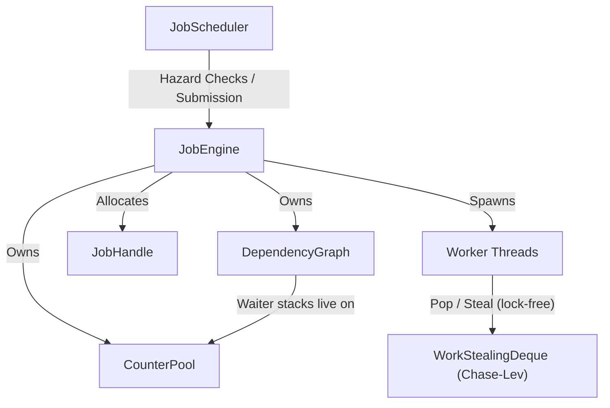

# Job System Module

The `job` module is a high-performance multi-threaded work-stealing job engine with automatic hazard-based dependency scheduling. Optimized for realtime/game-engine frame loops with zero-allocation job submission, lock-free work-stealing, and event-driven dependency resolution.

## Architecture & Design



### Components

1. **[`Platform`](./platform.h)**
   - Compile-time constants for cache-line sizing (auto-detects x86-64 vs ARM/Apple Silicon), job pool capacity, inline dependency limits, and worker spin counts.
2. **[`JobHandle`](./handle.h) & `CounterPool`**
   - `CounterPool`: Pre-allocated slots, each holding a job counter plus a generation tag, handed out from and returned to a lock-free (ABA-tagged) free list. Slots are reclaimed individually — once a handle's counter reaches zero *and* it has been closed — never in bulk, so a handle's lifetime is independent of any frame boundary.
   - `JobHandle`: Trivially-copyable 16-byte token (pool pointer + slot index + generation). Zero heap allocation on copy. Invalid and stale handles both report as always-complete; the generation tag is what distinguishes a stale handle from a live one occupying the same slot. Every handle must eventually be `close()`d (or wrapped in a `ScopedJobHandle`) to recycle its slot.
3. **[`Job`](./job.h) & `TaskWrapper`**
   - `TaskWrapper`: Small-buffer-optimized callable with a 48-byte inline buffer. Most game lambdas fit without heap spillover; oversized callables fall back to `std::function`.
   - `Job`: Contains a `TaskWrapper`, a `JobHandle` and a `JobType` — no dependency storage of its own, which keeps the zero-dependency fast path small. A job that *does* have dependencies is parked in a `PendingNode` (see below) until they are met.
4. **[`DependencyGraph`](./dependency_graph.h)**
   - Event-driven dependency resolution with no limit on fan-in. A dependent job becomes a `PendingNode` holding one `WaiterNode` per dependency, and each waiter is pushed onto that *dependency's own* lock-free waiter stack (stored in its `CounterPool` slot). Whichever thread drives a dependency's counter to zero harvests its stack and fires every waiter: no scanning, no global lock, no polling.
   - A harvest *closes* the stack it drains rather than merely emptying it, which is what gives every `WaiterNode` exactly one owner — either the harvester that popped it, or the submitter whose push was refused. That exclusivity is what makes it safe to free a `PendingNode` the moment its last dependency fires.
5. **[`Thread`](./thread.h)**
   - Non-copyable, non-movable thread wrapper managing execution loops, cooperative stop signals, and lifecycle logging.
6. **[`JobEngine`](./engine.h)**
   - Core parallel manager, built on per-thread lock-free Chase-Lev work-stealing deques. Workers use a spin-then-sleep strategy (configurable spin count) to minimize CV syscall overhead. Flat `std::array` lookup for thread dedications and type counts. Cache-line-padded atomics prevent false sharing. `create_handle()` allocates handles without touching the heap. `begin_frame()`/`end_frame()` reset per-frame diagnostic counters only, and compile to nothing unless `COOPA_JOB_DIAGNOSTICS` is on.
7. **[`JobScheduler`](./scheduler.h)**
   - Graph scheduler detecting RAW, WAR, and WAW hazards across enqueued jobs to auto-calculate dependencies. `begin_frame()` clears the persistent hazard-tracking maps so they never grow without bound; `end_frame()` drops any queued main-thread jobs that were never run, resolving their handles so dependents are not left waiting. Uses `unordered_set` for O(1) reader-is-also-writer checks.
8. **[`WorkStealingDeque`](./collections/work_stealing_deque.h)**
   - Lock-free Chase-Lev deque. Owner pushes/pops from the bottom (no synchronization), thieves steal from the top (single CAS). Fixed capacity, cache-line-padded top/bottom indices.

## Usage Code Example

```cpp
#include <coopa/job/engine.h>
#include <coopa/job/scheduler.h>

void game_frame() {
    coopa::job::JobEngine engine;
    coopa::job::JobScheduler scheduler(engine);

    struct Position { float x, y; };
    struct Velocity { float dx, dy; };

    // --- Frame start ---
    scheduler.begin_frame();

    // Register Position-Write job
    scheduler.add_job([]() {
        // Task A: Update positions
    }, 1, {}, {typeid(Position)});

    // Register Position-Read, Velocity-Read job
    // (automatically depends on Task A due to RAW hazard on Position)
    scheduler.add_job([]() {
        // Task B: Render positions
    }, 1, {typeid(Position), typeid(Velocity)}, {});

    // Resolve dependencies and submit to engine
    auto handles = scheduler.submit_all();

    // Execute any main-thread-only jobs
    scheduler.execute_main_thread_jobs();

    // Stall main thread until complete (participates in other engine tasks)
    scheduler.wait_for_all(handles);

    // --- Frame end ---
    scheduler.end_frame();
}
```

### Direct Engine Usage (without scheduler)

```cpp
#include <coopa/job/engine.h>

void direct_submit() {
    coopa::job::JobEngine engine(4); // 4 worker threads
    engine.begin_frame();

    // Allocate a handle from the counter pool
    coopa::job::JobHandle handle = engine.create_handle();

    // Submit jobs
    engine.submit([]() { /* work A */ }, 1, handle);
    engine.submit([]() { /* work B */ }, 1, handle);

    // Wait for completion (main thread helps execute other jobs while waiting)
    engine.wait_for(handle);

    engine.end_frame();
}
```

### Keeping background work out of frame-critical waits

A thread blocked in `wait_for()` (or `parallel_for_blocking()`) helps by running queued jobs.
By default it takes any job, so a frame waiting on 0.2 ms of crowd steering can pick up a
10 ms background build and stall the frame. Two rules prevent that:

- **Submit background work at `Priority::Low`, in short jobs.** Slice anything long into
  chained jobs that each resubmit the next (`ctx.engine->submit(..., ctx.group)`), so any thread
  that does pick one up loses only a fraction of a millisecond.
- **Wait with a help floor.** `wait_for(handle, Priority::Normal)` and
  `parallel_for_blocking(n, grain, body, type, Priority::Normal, Priority::Normal)` never run a
  `Low` job while waiting. Restrict a wait only when the awaited jobs run at the floor or above;
  otherwise the wait depends on other threads to run them.

```cpp
// Frame work: Normal chunks, and the main thread only helps with Normal+ while it waits.
engine.parallel_for_blocking(agents.size(), 64, step_agents, 0,
                             coopa::job::Priority::Normal, coopa::job::Priority::Normal);
// Background work: Low, and sliced.
engine.submit(BuildSlice{state}, 0, handle, nullptr, 0u, coopa::job::Priority::Low);
```

### Sharing one engine across subsystems

A single `JobEngine` can be shared freely by any number of long-lived
subsystems. Because `CounterPool` slots are generation-tagged and reclaimed
individually, one subsystem can never invalidate another's outstanding
`JobHandle`s, and no subsystem needs to own the frame boundary: any of them may
call `create_handle()`/`submit()`/`submit_jobs()`/`wait_for()` at any time.

`begin_frame()`/`end_frame()` only reset diagnostic counters, so calling them
from more than one place costs nothing but muddled diagnostics. A `JobEngine`
installed on a `coopa::scene::Scene` via `Scene::set_job_engine()` is shared on
exactly these terms — `Scene` does not touch the engine's frame boundary at all.

`coopa::asset::AssetManager` can likewise be handed an existing engine, and
falls back to constructing a private one only when none is supplied. Its
`decode()` jobs run at `Priority::Low` so they never preempt frame work.
