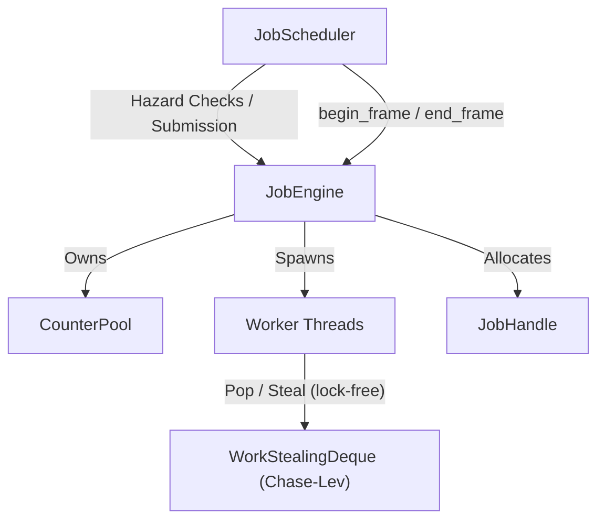

# Job System Module

The `job` module is a high-performance multi-threaded work-stealing job engine with automatic hazard-based dependency scheduling. Optimized for realtime/game-engine frame loops with zero-allocation job submission, lock-free work-stealing, and deterministic per-frame lifecycle management.

## Architecture & Design



### Components

1. **[`Platform`](./platform.h)**
   - Compile-time constants for cache-line sizing (auto-detects x86-64 vs ARM/Apple Silicon), job pool capacity, inline dependency limits, and worker spin counts.
2. **[`JobHandle`](./handle.h) & `CounterPool`**
   - `CounterPool`: Pre-allocated array of `atomic<int32_t>` counters with a lock-free bump allocator and per-frame `reset()`.
   - `JobHandle`: Trivially-copyable 16-byte token (pool pointer + index). Zero heap allocation on copy. Invalid handles report as always-complete.
3. **[`Job`](./job.h) & `TaskWrapper`**
   - `TaskWrapper`: Small-buffer-optimized callable with a 48-byte inline buffer. Most game lambdas fit without heap spillover; oversized callables fall back to `std::function`.
   - `Job`: Contains a `TaskWrapper`, a `JobHandle`, a `JobType`, and up to 4 inline dependency handles (`JobHandle deps[4]`). No `std::vector` or `std::function` heap allocations.
4. **[`Thread`](./thread.h)**
   - Non-copyable, non-movable thread wrapper managing execution loops, cooperative stop signals, and lifecycle logging.
5. **[`JobEngine`](./engine.h)**
   - Core parallel manager. Per-thread lock-free Chase-Lev work-stealing deques replace the previous mutex-guarded `std::deque` design. Workers use a spin-then-sleep strategy (configurable spin count) to minimize CV syscall overhead. Flat `std::array` lookup for thread dedications and type counts. Cache-line-padded atomics prevent false sharing. Provides `begin_frame()` / `end_frame()` lifecycle and `create_handle()` for zero-allocation handle allocation.
6. **[`JobScheduler`](./scheduler.h)**
   - Graph scheduler detecting RAW, WAR, and WAW hazards across enqueued jobs to auto-calculate dependencies. Per-frame `begin_frame()` / `end_frame()` clears persistent tracking maps to prevent unbounded memory growth. Uses `unordered_set` for O(1) reader-is-also-writer checks.
7. **[`WorkStealingDeque`](./collections/work_stealing_deque.h)**
   - Lock-free Chase-Lev deque. Owner pushes/pops from the bottom (no synchronization), thieves steal from the top (single CAS). Fixed capacity, cache-line-padded top/bottom indices.

## Usage Code Example

```cpp
#include <coopa/job/engine.h>
#include <coopa/job/scheduler.h>

void game_frame() {
    trav::job::JobEngine engine;
    trav::job::JobScheduler scheduler(engine);

    struct Position { float x, y; };
    struct Velocity { float dx, dy; };

    // --- Frame start ---
    scheduler.begin_frame();

    // Register Position-Write job
    scheduler.add_job([]() {
        // Task A: Update positions
    }, 1, {}, {typeid(Position)});

    // Register Position-Read, Velocity-Read job
    // (automatically depends on Task A due to RAW hazard on Position)
    scheduler.add_job([]() {
        // Task B: Render positions
    }, 1, {typeid(Position), typeid(Velocity)}, {});

    // Resolve dependencies and submit to engine
    auto handles = scheduler.submit_all();

    // Execute any main-thread-only jobs
    scheduler.execute_main_thread_jobs();

    // Stall main thread until complete (participates in other engine tasks)
    scheduler.wait_for_all(handles);

    // --- Frame end ---
    scheduler.end_frame();
}
```

### Direct Engine Usage (without scheduler)

```cpp
#include <coopa/job/engine.h>

void direct_submit() {
    trav::job::JobEngine engine(4); // 4 worker threads
    engine.begin_frame();

    // Allocate a handle from the counter pool
    trav::job::JobHandle handle = engine.create_handle();

    // Submit jobs
    engine.submit([]() { /* work A */ }, 1, handle);
    engine.submit([]() { /* work B */ }, 1, handle);

    // Wait for completion (main thread helps execute other jobs while waiting)
    engine.wait_for(handle);

    engine.end_frame();
}
```
