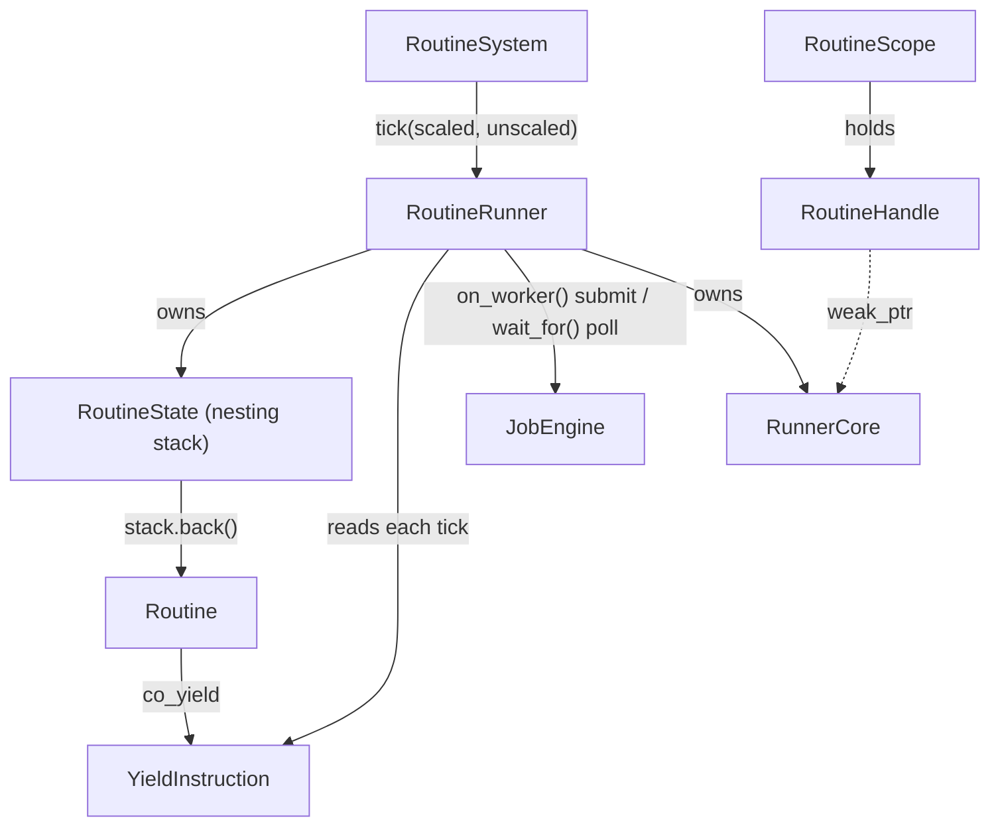

# Routine Module

The `routine` module is a Unity-style coroutine system built on C++20 `<coroutine>`. A behaviour that spans frames is written as straight-line code instead of a hand-rolled state machine with member accumulators, and — unlike Unity — a routine can suspend on `coopa/job` work without occupying a thread.

## Architecture & Design



### Components

1. **[`YieldInstruction` & the yield vocabulary](./yield.h)**
   - The single internal representation of "what this routine is waiting for", plus the factories a body yields: `next_frame()`, `frames(n)`, `seconds(s)`, `seconds_realtime(s)`, `wait_until(pred)`, `wait_while(pred)`, `wait_for(job_handle)`, `on_worker(fn)`.
   - One instruction exists per *suspended routine* (it lives on that routine's promise), never one per frame.
   - Owns two things it must clean up if it is dropped before the runner takes them: a nested coroutine frame, and a `JobHandle` the runner allocated for an `on_worker()` body.
2. **[`Routine`](./routine.h)**
   - A move-only owner of one coroutine frame — the return type of every routine body. Destroying it destroys the frame, running every live local's destructor, so RAII inside a routine body is sound.
   - `initial_suspend()` suspends, so a `Routine` is safe to move around before it is started; `RoutineRunner::start()` does the first resume immediately, reproducing Unity's "StartCoroutine runs the body synchronously up to the first `yield return`".
   - An exception that escapes the body is captured on the promise rather than propagating; the runner logs it and stops the routine.
3. **[`RoutineRunner`](./runner.h)**
   - Owns a set of running routines and resumes the eligible ones once per `tick()`. A routine body always resumes on the thread that calls `tick()`, so it may mutate a `Scene` as freely as `Component::update()` may.
   - Each routine holds a *nesting stack*: `co_yield other_routine()` pushes, a completed child pops, which is how Unity stacks nested enumerators. A child that finishes hands control straight back to its parent **in the same tick**, rather than costing a frame per nesting level.
   - Re-entrancy follows the rules `coopa::event::Signal` already uses for connect/disconnect during `emit()`: starting a routine from inside a routine body is safe (it joins the pump at the end of the current tick), and stopping one — including itself — is safe. A coroutine frame is never destroyed while it is executing.
4. **[`RoutineHandle` & `RoutineScope`](./runner.h)**
   - `RoutineHandle`: a copyable token, safe to hold past its runner's lifetime. The runner owns a `RunnerCore` control block that handles reference weakly, so a handle outliving its runner degrades to "not running" rather than dangling — exactly what `coopa::event::Connection` does for `Signal`.
   - `RoutineScope`: the `ScopedConnection` analogue. Move-only RAII that stops every routine it started when destroyed. Held as a member, it ties a component's routines to that component's lifetime.
5. **[`RoutineSystem` & Component helpers](./routine_system.h)**
   - The `ISceneSystem` registered at `coopa::scene::UpdatePhase::Routine` (250) — after the built-in `Component::update()` walk and before `late_update()`, matching Unity's frame order.
   - `set_time_scale()` is Unity's `Time.timeScale`: at 0 every `seconds()` wait pauses while `seconds_realtime()` keeps running at wall-clock speed.
   - `start_routine(component, ...)` / `stop_routines(component)` are the `StartCoroutine` / `StopAllCoroutines` equivalents; `runner_for()` reaches the runner from a `Scene` or a `Component`.

## Usage Code Example

```cpp
#include <coopa/routine/routine_system.h>

using namespace coopa::routine;

Routine open_door(Door& door) {
    door.play_sound();
    co_yield seconds(0.2f);                       // WaitForSeconds

    for (float t = 0.0f; t < 1.0f; t += 0.02f) {
        door.set_angle(t * 90.0f);
        co_yield next_frame();                    // yield return null
    }

    co_yield wait_until([&door] { return door.player_inside(); });  // WaitUntil
    door.close();
}
```

### Registering the system

Not auto-installed — register it exactly as `coopa::anim::AnimationSystem` is registered:

```cpp
scene.add_system(std::make_unique<RoutineSystem>(), coopa::scene::UpdatePhase::Routine);
```

### Tying routines to a component's lifetime

```cpp
class Door : public coopa::scene::Component {
public:
    std::string type_name() const override { return "Door"; }

    void start() override {
        routines_.start(*this, open_door(*this));  // stops when this component dies
    }

private:
    RoutineScope routines_;
};
```

For a routine that should outlive the object that started it, use the free functions instead:

```cpp
RoutineHandle h = start_routine(*this, open_door(*this));
// ... later ...
h.stop();                  // or stop_routines(*this) for all of them
```

### Awaiting job work

This is the piece Unity has no equivalent for. The routine occupies no thread while it waits, and the code after the `co_yield` is back on the tick thread and free to touch the Scene:

```cpp
Routine load_level(coopa::job::JobEngine& jobs, Level& level) {
    coopa::job::JobHandle chunks =
        jobs.parallel_for(level.chunk_count(), 64,
                          [&level](size_t begin, size_t end) { level.bake(begin, end); });

    co_yield wait_for(chunks);         // suspended, not blocked
    chunks.close();                    // wait_for() never closes a handle it did not allocate

    co_yield on_worker([&level] { level.decompress_textures(); });

    level.spawn_everything();          // back on the tick thread
}
```

`on_worker()` allocates and closes its own handle. With no engine installed on the runner, the body runs inline on the tick thread and the routine resumes on the next tick — the same graceful degradation a null `FrameContext::jobs` already gives every scene system.

### Nesting

```cpp
Routine intro() {
    co_yield fade_in();        // yield return StartCoroutine(FadeIn())
    co_yield seconds(1.0f);
    co_yield fade_out();
}
```

The child starts immediately and runs to completion before the parent resumes. Unlike Unity, the parent picks up in the same tick the child finished in.

### Standalone, without a Scene

`RoutineRunner` has no dependency on `coopa/scene` — only `routine_system.h` does. Any frame loop can drive one directly:

```cpp
RoutineRunner runner(&engine);   // engine optional
runner.start(open_door(door));

while (running) {
    time.update();
    runner.tick(time.delta_time());
}
```

## Threading

`RoutineRunner` is **not** thread-safe: `start()`, `stop()` and `tick()` on one runner must all be called from the same thread. That is deliberate — it is what lets a routine body mutate a `Scene` directly. The `JobEngine` is used only to run work a routine *awaits*; routine bodies themselves are never resumed on a worker.
